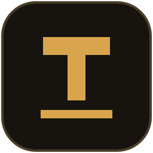
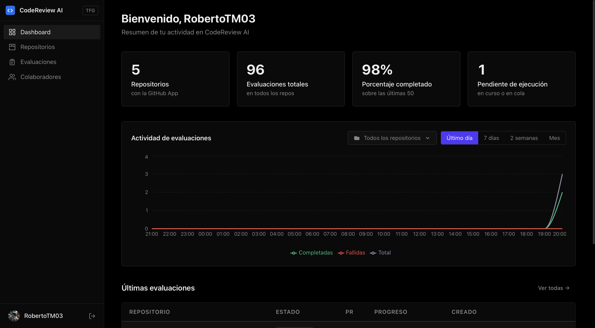
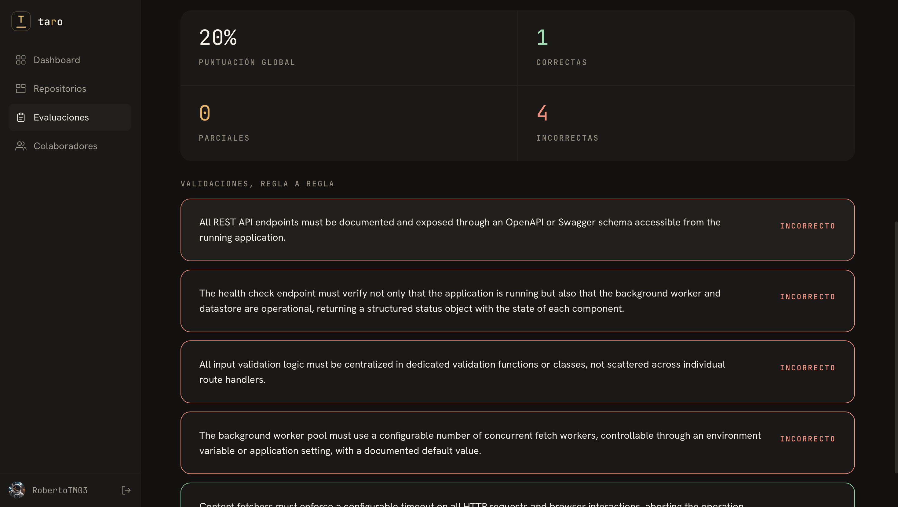

<p align="center">
  
</p>

<h1 align="center">Taro</h1>
<p align="center">
  Semantic Repository Validator — check your code against rules written in plain language.
</p>

<p align="center">
  <strong>Define your team's conventions once, and get a per-rule verdict with explanations and code references on every pull request.</strong>
  <br>
  Powered by vector search and LLM evaluation, wired into GitHub through a GitHub App.
</p>

<p align="center">
  
  
  
  
  
  
</p>

<p align="center">
  <a href="#how-it-works">How it works</a> &nbsp;|&nbsp;
  <a href="#stack">Stack</a> &nbsp;|&nbsp;
  <a href="#quick-start">Quick start</a> &nbsp;|&nbsp;
  <a href="#github-app-setup">GitHub App setup</a>
</p>



---

## How it works

For each rule, the system retrieves the most semantically relevant code chunks from the repository using vector search, builds a focused context window, and asks a configured LLM to evaluate compliance. Results include a verdict (`pass`, `partial`, or `fail`), a explanation, and actionable suggestions.

When **cross-check mode** is enabled, two independent LLMs evaluate each rule. If they agree, the consensus result is used. If they disagree, a third discriminator LLM adjudicates. This pipeline reduces false positives caused by LLM inconsistency.



**Key capabilities**

- Natural-language rule definitions with per-rule enable/disable toggles
- Incremental indexing — only changed files are re-embedded between runs
- Dual-model cross-check with discriminator and full audit trail
- Automatic GitHub PR evaluation: commit status + detailed comment
- Real-time progress via WebSocket with polling fallback

---

## Stack

| Layer | Technology |
|---|---|
| Frontend | React 18, Feature-Sliced Design, Tailwind CSS |
| Backend | FastAPI, hexagonal architecture, Python 3.12 |
| Database | PostgreSQL 16 (pgvector for embeddings) |
| LLM providers | Google Gemini, Azure OpenAI |
| Embeddings | Google Gemini Embedding, Voyage AI |
| Infrastructure | Docker Compose, ChromaDB, ngrok |

---

## Prerequisites

- Docker Desktop
- [Google AI Studio](https://aistudio.google.com) API key (`GOOGLE_API_KEY`)
- [ngrok](https://ngrok.com) account (`NGROK_AUTHTOKEN`)
- A GitHub App (see [GitHub App setup](#github-app-setup))
- Azure OpenAI deployment — optional, required for `azure/*` models
- [LangSmith](https://smith.langchain.com) account — optional, required for cross-check discriminator

---

## Quick start

```bash
git clone <repository-url>
cd TFG
cp .env.example .env
```

Set the minimum required variables in `.env`:

```env
GITHUB_CLIENT_ID=           # from your GitHub App (OAuth credentials)
GITHUB_CLIENT_SECRET=
GITHUB_CALLBACK_URL=http://localhost:8080/auth/callback
GOOGLE_API_KEY=
NGROK_AUTHTOKEN=
```

Start the stack:

```bash
docker compose up --build
```

Open [http://localhost:3000](http://localhost:3000) and sign in with GitHub. All other variables have defaults suitable for local development — see `.env.example` for the full reference.

---

## GitHub App setup

The GitHub App provides OAuth credentials for user login and acts as the bot that posts PR comments and commit statuses.

1. Go to **GitHub → Settings → Developer settings → GitHub Apps → New GitHub App**
2. Set **Homepage URL** to `http://localhost:3000`, **Callback URL** to `http://localhost:8080/auth/callback`, and generate a **Webhook secret**
3. Grant repository permissions: `Contents` (read), `Pull requests` (read & write), `Commit statuses` (read & write). Subscribe to the `Pull request` event
4. After creating the app, generate a **private key** (`.pem`) and place it in `backend/secrets/`
5. Add to `.env`:

```env
GITHUB_APP_ID=
GITHUB_APP_PRIVATE_KEY_PATH=/app/secrets/your-key.pem
GITHUB_APP_SLUG=
GITHUB_WEBHOOK_SECRET=
APPROVAL_THRESHOLD=0.8      # score >= threshold marks the PR as approved
```

6. After the stack starts, copy the ngrok URL from [http://localhost:4040](http://localhost:4040) and set it as the **Webhook URL** in the GitHub App settings:
   ```
   https://<subdomain>.ngrok-free.app/webhooks/github
   ```

> On the ngrok free plan the tunnel URL changes on every restart. Update the Webhook URL accordingly.

---

## Cross-check discriminator (LangSmith)

Create a prompt named `cross-check-discriminator` in LangSmith Hub with the following messages, then set the corresponding variables in `.env`.

**System message**
```
You are a senior software engineering expert adjudicating two conflicting evaluations of the same semantic rule.

Respond ONLY with valid JSON (no markdown):
{
    "verdict": "pass" | "fail" | "partial",
    "explanation": "<reasoning citing the strongest arguments from both evaluations>",
    "suggestions": ["<suggestion 1>"]
}

If suggestions are not needed, return []. Do not include control characters inside JSON strings.
```

**Human message**
```
Rule: {rule}

Evaluation A (verdict: {primary_verdict}): {primary_explanation}
Evaluation B (verdict: {secondary_verdict}): {secondary_explanation}

Adjudicate and emit the final verdict.
```

```env
LANGSMITH_API_KEY=
LANGSMITH_PROJECT=TFG
LANGSMITH_TRACING=true
LLM_PRIMARY_MODEL=gemini-2.5-flash
LLM_SECONDARY_MODEL=gemini-3.1-flash-lite-preview
LLM_DISCRIMINATOR_MODEL=azure/gpt-4o
LANGSMITH_DISCRIMINATOR_PROMPT=cross-check-discriminator
```

---

## Usage guide

1. **Sign in** at [http://localhost:3000](http://localhost:3000) using your GitHub account.
2. **Install the GitHub App** on the repositories you want to validate. The app will prompt you on first login if no installation is detected.
3. **Open a repository** from the dashboard and go to the **Rules** tab.
4. **Add rules** in plain language, one per entry (e.g. *"All functions must have a docstring"*, *"Dependencies must be pinned to exact versions"*). Rules can be reordered and individually disabled.
5. **Configure the repository** in the Settings tab: choose the LLM model, enable cross-check mode, and set the approval threshold.
6. **Run a validation** manually with the *Validate* button, or open a pull request on GitHub — the system evaluates automatically and posts the result as a PR comment and commit status.
7. **Inspect results** in the task detail view: each rule shows its verdict, the LLM explanation, relevant code excerpts, and — when cross-check is active — the full audit trail with primary, secondary, and discriminator verdicts.

---

## Local service URLs

| Service | URL |
|---|---|
| Frontend | http://localhost:3000 |
| Backend API | http://localhost:8080 |
| Swagger UI | http://localhost:8080/docs |
| ngrok inspector | http://localhost:4040 |
| PostgreSQL | `localhost:5432` — `tfg_validator` |
